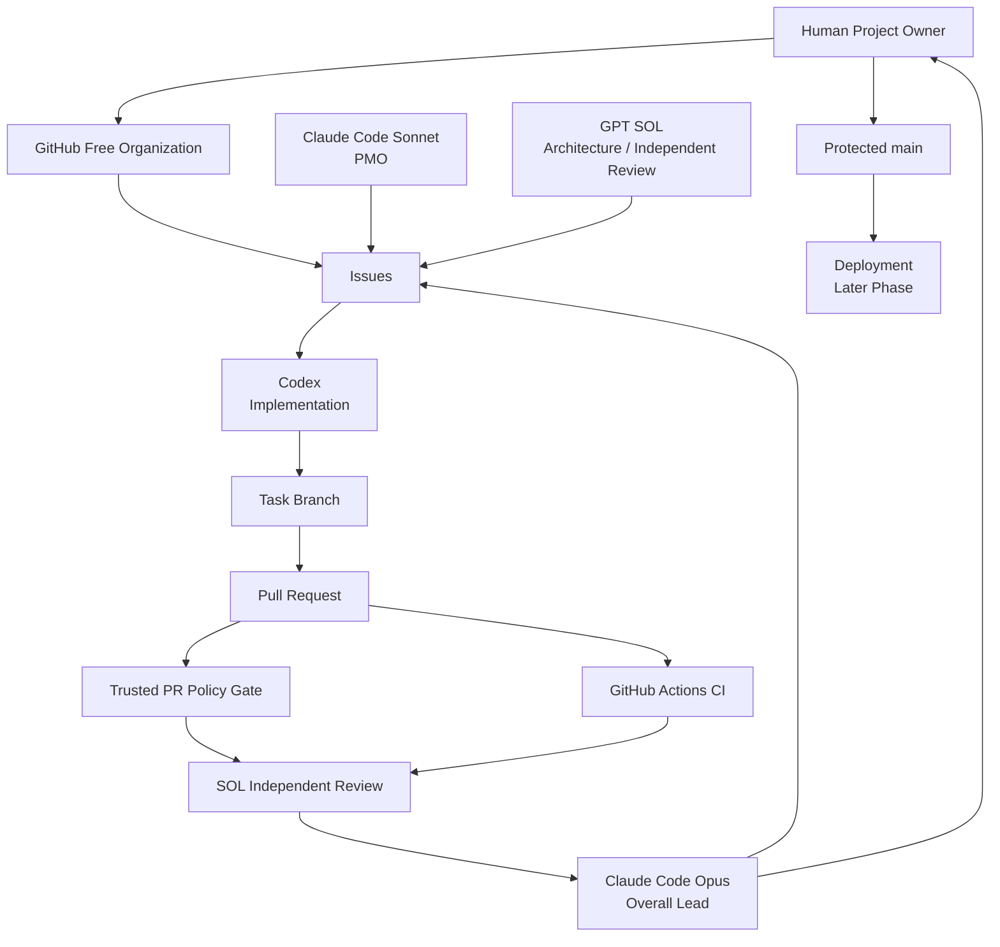

# 独ソ戦3D Historical Visualizer
## GitHub Cloud 開発基盤 基礎設計 v0.3

**Status:** Reviewed Baseline Proposal  
**Date:** 2026-08-12  
**Architecture / Independent Review:** GPT SOL  
**Upstream Foundation:** Project Foundation v0.1  
**Additional Delivery Constraint:** Desktop + Smartphone Browser Support

---

## 0. 結論

本プロジェクトのGitHub開発基盤は、以下を基礎構成とする。

- **GitHub Freeを前提**とする。
- Repositoryは **GitHub Free Organization配下のPublic Single Repository** を推奨する。
- `main` は **Protected Branch** とし、Pull RequestとRequired Status Checksを必須化する。
- `main`へのpush / merge権限は、可能な限り **Human Project Ownerのみ** に限定する。
- 開発branchは短命branchとし、`develop`等の長期統合branchは設けない。
- Merge方式は **Squash Mergeのみ** とする。
- **Codexが実装・テスト・修正**を担当し、人間Project Ownerはコーディング・デバッグを行わない。
- Build / Test / Validationの正本は **GitHub Actions** とする。
- **GitHub Codespacesは初期構成に含めない。**
- GitHub PagesはProduction公開候補とするが、Technology Selection後に正式決定する。
- Historical DataはApplication codeと同一Repositoryに配置するが、専用namespace・専用Validationを持つ設計とする。
- Historical Source原本は、再配布可能性を確認できたもの以外はRepositoryに格納しない。
- GitHub上のIssue / PR / Commit / Actions / Documentation / Historical DataをSingle Source of Truthとする。
- 最終Web Applicationは **Desktop Browser + Smartphone Browser** を正式な利用対象とし、スマートフォン対応を後付け要件にしない。
- SOL Independent ReviewはPR HEAD SHAに紐付け、HEAD変更時には失効させる。
- AIによる自己承認・自己Mergeは禁止する。
- 最終MergeはHuman Project Ownerが実行する。

---

# 1. 設計レビュー結果

前回案を、以下の追加前提に基づいて再レビューした。

1. GitHubは有料プランを使用しない。
2. Human Project Ownerはプログラミングを行わない。
3. Human Project Ownerはデバッグ・Terminal操作を行わない。
4. GitHub Cloud Onlyを維持する。
5. AIが実装・検証・修正を担う。
6. Historical Dataの史料トレーサビリティを最優先する。

## 1.1 レビューで修正した主要点

| ID | 論点 | 旧案 | 修正版 | 理由 |
|---|---|---|---|---|
| R-01 | Repository owner | Personal account想定 | **GitHub Free Organization推奨** | Public repoでmainへのpush主体を限定しやすく、AIとHumanの責任分離を強化できる |
| R-02 | Repository visibility | Private開始案 | **Public** | GitHub FreeでProtected Branch / Rulesets / Pages等を活用するため |
| R-03 | Codespaces | 採用 | **初期導入しない** | Humanがコーディング・デバッグしないため常設価値が低い |
| R-04 | Human-only Merge | 運用ルール中心 | **権限制御も併用** | AIがmainを更新できる余地を可能な限り排除するため |
| R-05 | main protection | Ruleset中心 | **単一Branch Protection Ruleを初期推奨** | 対象がmainのみであり、より単純に必要要件を満たせる |
| R-06 | PR Policy CI | 通常CIと同列 | **Trusted Policy Gateとして分離** | PR自身によるPolicy Workflow改変でGateを自己無効化するリスクを下げる |
| R-07 | Public repo contents | 一般的な注意のみ | **Public Repository Content Policyを追加** | Historical SourceやAssetsの再配布リスクを明示的に防ぐため |
| R-08 | Human作業 | 手動debugの余地あり | **判断・承認・Mergeに限定** | Project Ownerにプログラミング技能を要求しないため |
| R-09 | Native approval | 1 approval候補 | **初期0 approvals** | SOL ReviewはGitHub native human reviewとは別の独立レビューであるため |
| R-10 | Production | Pages有力 | **後続決定** | Technology Selection前にstatic hosting適合性を確定しないため |
| R-11 | Client target | Desktop中心の暗黙前提 | **Desktop + Smartphone Browserを正式対象** | 後続のMVP・UI・技術選定・テストでスマホを初期制約として扱うため |

---

# 2. Foundationとの整合性

Project Foundation v0.1の以下の原則は変更しない。

## 2.1 品質優先順位

> 史実性 ＞ トレーサビリティ ＞ 理解しやすさ ＞ 網羅性 ＞ 視覚的演出

GitHub基盤はこの優先順位を支援するための開発インフラであり、Historical Dataの内容そのものを決定するものではない。

## 2.2 AI責任分離

```text
Requirements / Architecture
        ↓
      GPT SOL
        ↓
Implementation Instructions
        ↓
       Codex
        ↓
Implementation / Tests
        ↓
GPT SOL Independent Review
        ↓
Claude Code Opus
        ↓
Integration Decision
        ↓
Human Project Owner
        ↓
Merge
```

実装者と独立レビュー担当を分離する。

Codexによる自己承認は禁止する。

## 2.3 Single Source of Truth

```text
GitHub
├── Repository
├── Issues
├── Pull Requests
├── Branches
├── Actions
├── Documentation
└── Historical Data
```

AIとの会話ログは作業空間であり正本ではない。

重要な決定・設計・レビュー・変更履歴はGitHubへ反映する。

## 2.4 Target Client Constraint

最終成果物であるWeb Applicationは、以下を正式な利用対象とする。

```text
Desktop Browser
+
Smartphone Browser
```

スマートフォン対応は、Desktop版完成後の追加対応ではなく、**MVP・UI設計・Technology Selection・Test設計に最初から影響する上位制約**として扱う。

ただし本GitHub基盤設計フェーズでは、以下をまだ確定しない。

- responsive layoutの具体方式
- mobile-first / desktop-firstの実装方式
- smartphone向け3D描画品質
- 対応ブラウザの具体的version matrix
- portrait / landscapeの詳細仕様
- touch gesture仕様
- device別performance budget

これらは後続フェーズで決定する。

本フェーズで固定するのは、**「PC専用のWeb Applicationとして設計してはならない」**という制約である。

---

# 3. GitHub Cloud Onlyの運用定義

本プロジェクトにおける **GitHub Cloud Only** を以下のように定義する。

> ソースコード、Historical Data、Issue、設計文書、変更履歴、Pull Request、テスト結果、Build、CI、レビュー記録、Deploymentの正本および実行基盤をGitHub Cloud上に置き、Human Project Ownerのローカル開発環境を必要としない。

これは、すべてのAI推論処理そのものがGitHubサーバー上で動作しなければならない、という意味ではない。

AIが使用する実装環境は、GitHub Repository / Branch / PRと直接連携し、成果物をGitHubへ記録できるクラウド実行方式であることを要求する。

## 3.1 Human Project Ownerに要求しないもの

以下をHuman Project Ownerの責務に含めない。

- コーディング
- Terminal操作
- Git CLI操作
- Buildコマンド実行
- Testコマンド実行
- Debugger操作
- CIログの技術解析
- Dependency問題の技術修正
- Merge conflictの手動解消
- 開発環境構築

これらはAIまたはGitHub Actionsが担当する。

---

# 4. Recommended GitHub Architecture



---

# 5. Account / Organization Design

## 5.1 推奨

**GitHub Free Organizationを作成し、そのOrganization配下にPublic Repositoryを1つ作成する。**

### 理由

Personal account直下のPublic RepositoryでもProtected Branchは利用できるが、本プロジェクトではAIとHuman Project Ownerの責任分離が重要である。

GitHub Free Organization配下のPublic Repositoryでは、`main`に対してpush可能なactorを限定できる構成が取りやすい。

これにより、

```text
AI
  └─ task branch / PR

Human Project Owner
  └─ protected mainへの最終Merge
```

という境界をGitHub設定として表現できる。

## 5.2 Organization Role

Human Project Owner：

- Organization Owner
- Repository Admin

AI：

- Organization Ownerにしない
- Repository Adminにしない
- Branch Protection bypassを与えない
- Secrets管理権限を与えない
- Repository削除権限を与えない

## 5.3 重要な制約

Human Project OwnerとAIが**同一GitHub Identity / 同一Owner credentialを共有した場合、Human-only Mergeを技術的に区別できない**。

したがってAI integrationには、可能な限り独立したGitHub App / service identity /限定権限を使用する。

具体的なAIごとのGitHub接続方式はRepository構築時に確認する。

---

# 6. Repository Design

## 6.1 Repository数

**1 Repository**

Multi-repositoryは採用しない。

理由：

- ApplicationとHistorical Dataの整合変更を同一PRで扱える。
- Schema変更とData migrationをatomicに検証できる。
- Source IDとVisualizer実装のTraceabilityが単純になる。
- AI間のIssue / PR依存関係を増やさない。
- MVP規模では分割メリットより運用コストが大きい。

## 6.2 Visibility

**Public**

GitHub Freeでmain protection、Actions、Pages等を最大限活用するため。

### 注意

Public Repositoryであることと、Open Source Licenseを付与することは別である。

**LICENSEは自動的に追加しない。**

ライセンス選定は、コード・Historical Dataset・Assetsの公開方針を確認後に決定する。

---

# 7. Repository Directory Baseline

```text
/
├── .github/
│   ├── ISSUE_TEMPLATE/
│   │   ├── general.yml
│   │   └── historical.yml
│   ├── workflows/
│   │   ├── policy-gate.yml
│   │   └── repository-validation.yml
│   └── pull_request_template.md
│
├── docs/
│   ├── foundation/
│   ├── architecture/
│   ├── governance/
│   └── decisions/
│
├── src/
├── tests/
├── assets/
│
├── historical/
│   ├── data/
│   ├── sources/
│   ├── schemas/
│   └── validation/
│
├── scripts/
│
└── README.md
```

## 7.1 未確定領域

以下はnamespaceのみ確保し、詳細設計を先行しない。

- `historical/data/`
- `historical/sources/`
- `historical/schemas/`
- `historical/validation/`

具体的Schema、Source ID形式、Confirmed / Estimated / Unknown等はHistorical Data Modelフェーズで決定する。

---

# 8. Public Repository Content Policy

Public Repositoryにcommitする情報は、**公開可能であることを前提**とする。

## 8.1 Repositoryに格納可能

- Source Code
- Tests
- Documentation
- Historical Dataset
- Historical Source Metadata
- Schema
- Validation rules
- 自作Assets
- Public Domain Assets
- 再配布許諾が確認できたAssets

## 8.2 原則格納禁止

- 購入した電子書籍
- 書籍PDF
- 無許可のスキャン史料
- 再配布条件不明の地図
- 再配布条件不明の写真
- ライセンス不明Assets
- API Key
- Token
- Password
- Secret
- 個人情報
- 契約上非公開の情報

## 8.3 Historical Source

Source原本をRepositoryに置くことをTraceabilityの要件とはしない。

最低限、

```text
Source ID
Title
Author / Institution
Publication
Page
URL / Archive ID
Access Metadata
```

等を通じて元史料へ逆引き可能な構造を作る。

原本ファイルを格納する場合のみ、再配布可能性を確認する。

---

# 9. Branch Strategy

## 9.1 Branch種類

```text
main
├── feature/<issue>-<slug>
├── fix/<issue>-<slug>
├── data/<issue>-<slug>
├── docs/<issue>-<slug>
└── infra/<issue>-<slug>
```

## 9.2 原則

- `main`は常に統合済み正本。
- task branchは最新`main`から作る。
- 原則として1 Issue = 1 branch = 1 PR。
- branchは短命とする。
- merge後に自動削除する。
- `develop`は作らない。
- `release/*`は初期導入しない。
- `hotfix/*`専用フローは作らない。
- 長期統合branchは作らない。

## 9.3 理由

AI開発ではbranch種類を増やすほど、

- 正本判断
- merge順序
- dependency管理
- review対象SHA

が複雑化する。

本プロジェクトではmain中心の最小構成を採用する。

---

# 10. Merge Strategy

Repository設定：

```text
Squash Merge: ON
Merge Commit: OFF
Rebase Merge: OFF
Auto Merge: OFF
Automatically delete head branches: ON
```

## 10.1 Squash採用理由

- 1 PR = 1 logical changeとしてmain履歴を残せる。
- AI実装中の細かい修正commitをmainへ持ち込まない。
- Issue / PR / main commitの対応関係を追いやすい。
- revert単位が明確になる。

---

# 11. main Branch Protection

初期構成では、複数Rulesetを組み合わせず、**`main`専用のBranch Protection Ruleを1つ使用する。**

## 11.1 main protection設定

| Setting | 初期値 |
|---|---:|
| Require a pull request before merging | **ON** |
| Required approving reviews | **0** |
| Require status checks before merging | **ON** |
| Require branches to be up to date | **ON** |
| Require conversation resolution | **ON** |
| Restrict who can push to matching branches | **Human Project Ownerのみ** |
| Allow force pushes | **OFF** |
| Allow deletions | **OFF** |
| Do not allow bypassing the above settings | **ON** |
| Require signed commits | OFF |
| Require linear history | OFF |
| Require merge queue | OFF |
| Require deployments before merging | OFF |

## 11.2 Required approving reviewsを0とする理由

GitHub native approvalとSOL Independent Reviewは役割が異なる。

SOLが独立GitHub reviewer identityを持つことは現時点では確定していない。

またHuman Project Owner自身のPRに対してHuman本人のapprovalを要求する設計は責任分離として意味を持たない。

そのため、

```text
Native GitHub approval
≠
SOL Independent Review
```

とする。

SOL Reviewは別途Policy Gateで扱う。

## 11.3 Human-only Merge

Protected `main`へのpush可能actorをHuman Project Ownerに限定する。

AI user / AI GitHub Appを`main` push許可対象へ追加しない。

AIにはadmin / bypass権限を与えない。

これにより、AIはtask branchとPRまでを担当し、`main`更新はHuman Project Ownerへ残す。

### Identity制約

この技術的分離は、AIがHuman Project Ownerとは異なるGitHub identityを使用する場合に成立する。

AIがProject Ownerのowner sessionそのものを使用する場合は完全な技術分離ができない。

そのためRepository構築時にAI integration方式を確認し、Owner credentialをAIへ恒常的に渡さない。

---

# 12. Pull Request Workflow

```text
Issue
  ↓
Opus: Priority / Go
  ↓
Sonnet: Issue readiness / dependencies
  ↓
Codex: task branch作成
  ↓
Codex: Implementation + Tests
  ↓
Draft PR
  ↓
Repository Validation
  ↓
Application CI
  ↓
Ready for Review
  ↓
PR Policy Gate
  ↓
SOL Independent Review
  ↓
PASS / CHANGES_REQUIRED
  ↓
[変更があれば]
Codex修正
  ↓
HEAD SHA変更
  ↓
SOL Review失効
  ↓
再CI
  ↓
SOL再Review
  ↓
Opus Integration Decision
  ↓
Human Project Owner
  ↓
Squash Merge
```

---

# 13. Pull Request Template

```markdown
## Objective

## Related Issue

## Scope

## Changes

## Tests

## Historical Data Impact
NONE / YES

## Source Traceability Impact
NONE / YES

## Client Compatibility Impact
NONE / DESKTOP / SMARTPHONE / BOTH

## Known Limitations

## Current HEAD

---

## SOL Independent Review

SOL review commit:
SOL review decision:
BLOCKER:
MUST FIX:
Current HEAD:

---

## Integration Decision

Opus decision:
Decision HEAD:
```

Historical Data Impactが`YES`の場合：

```markdown
## Historical Change Detail

Affected Source IDs:
Source / Evidence:
Traceability Impact:
Validation Result:
Known Uncertainty:
```

---

# 14. SOL Independent Review

## 14.1 Review identity

SOL Reviewは**特定PR HEAD SHAに対する独立レビュー**とする。

PASS条件：

```text
SOL review commit == actual PR HEAD SHA
Current HEAD == actual PR HEAD SHA
SOL review decision == PASS
BLOCKER == 0
MUST FIX == 0
```

## 14.2 HEAD変更

SOL PASS後に新commitがpushされた場合：

```text
Reviewed HEAD = abc123
New HEAD      = def456
```

となるため、

```text
SOL REVIEW = STALE / INVALID
```

と判定する。

再レビューを完了するまでMerge不可。

## 14.3 Identityの限界

PR本文だけでは、

> 「SOL review decision: PASS」

を書いたactorが本当にSOLであることまで完全には証明できない。

したがって初期構成では、

1. SHA一致
2. Policy Gate
3. SOL独立レビュー
4. Opus統括判断
5. Human-only Merge

を組み合わせる。

将来、SOL専用GitHub App / reviewer identityを用意できた場合は、review actor identity validationを追加検討する。

---

# 15. CI/CD Foundation

CIは段階導入する。

Visualization技術やpackage managerを現段階で仮定しない。

## 15.1 Phase 0 — GitHub Foundation

初期導入：

### A. `policy-gate.yml`

役割：

- PR本文必須欄確認
- Related Issue確認
- Current HEAD整合確認
- SOL review commit整合確認
- PASS時BLOCKER = 0確認
- PASS時MUST FIX = 0確認
- Historical Data Impact欄確認
- Source Traceability Impact欄確認

### B. `repository-validation.yml`

役割：

- Repository基本構造
- 必須文書
- 基本format
- Foundation / Governance整合性チェック

Technology Selection前のため、特定言語のbuild/testは要求しない。

---

# 16. Trusted PR Policy Gate

PR Policy Gateは通常のApplication CIと分離する。

## 16.1 問題

通常の`pull_request` workflowだけを使用すると、PR自身がPolicy Workflowを変更するケースを考慮する必要がある。

Governance GateがPR側の変更に直接依存すると、実装者がGate自体を変更できる構造になり得る。

## 16.2 設計

Policy Gateは**base branch側の信頼済みWorkflow定義を使用する構成**とする。

候補として`pull_request_target`を使用できる。

ただし、`pull_request_target`は権限の強いcontextになり得るため、以下を厳守する。

### MUST

- PR codeをcheckoutしない。
- PR branch上のscriptを実行しない。
- PR由来の実行可能コードを呼ばない。
- Secretを渡さない。
- `permissions`を明示的な最小read権限とする。
- GitHub event metadata / API上のPR metadataだけを検証する。
- PR title / body等をshell commandへ未処理で埋め込まない。

つまりPolicy Gateは、

```text
PR Metadata
PR HEAD SHA
Issue relation
Review fields
```

だけを見る。

Application codeのBuild / Testは通常の`pull_request` CIで実行する。

## 16.3 分離

```text
Trusted Policy Gate
  └─ Governance / metadataのみ

Application CI
  └─ PR code / tests / build
```

この2つを混ぜない。

## 16.4 Governance-sensitive paths

以下は通常のFeature / Data変更より強く扱う。

```text
.github/workflows/**
.github/ISSUE_TEMPLATE/**
.github/pull_request_template.md
docs/foundation/**
docs/governance/**
```

原則：

- `infra/*` または明示的なgovernance変更PRとして分離する。
- 通常Feature PRへ便乗させない。
- 変更理由と影響範囲をPR本文へ明記する。
- SOL Independent Reviewを必須とする。
- Opus Integration Decisionを必須とする。
- Human Project Ownerが最終Mergeする。
- `policy-gate.yml`の変更は、そのPR自身のPolicy Gate判定ロジックへ即時反映させない。base branch上の信頼済み定義で当該PRを評価し、Human Merge後に将来のPRへ反映する。

これにより、実装AIが通常の機能変更に紛れてガバナンスやCI Gate自体を弱めることを防ぐ。

---

# 17. Application CI

Technology Selection後に追加する。

Desktop / Smartphoneの双方を正式な利用対象とするため、後続のCI / Test設計では、少なくとも以下を検討対象に含める。

- responsive layout regression
- smartphone viewportでの主要画面確認
- touch操作を前提とした主要interaction
- mobile browserでのbuild/runtime compatibility
- device性能差を考慮したperformance validation

ただし具体的なbrowser matrix、E2E tool、viewport値、performance thresholdはTechnology Selection後に決定する。

基本構造：

```text
Install
  ↓
Lint
  ↓
Type Check
  ↓
Unit Test
  ↓
Build
  ↓
CI / required
```

Ruleset / Branch Protectionから参照するRequired Check名は安定させる。

例：

```text
policy / pr-policy
ci / required
```

Workflow内部jobを変更しても、外部Required Check名を不用意に変えない。

---

# 18. Historical Data Validation

Historical Data Model確定後に導入する。

候補：

- Schema Validation
- Source ID Validation
- Source Traceability Validation
- Broken Reference Validation
- Duplicate Source ID Validation
- Orphaned Historical Data Validation
- Required Evidence Validation
- Historical numeric change validation
- Source deletion / rename detection

## 18.1 Historical Data変更ルール

`historical/**`を変更するPRは必ず、

```text
Historical Data Impact = YES
Source / Evidence
Affected Source IDs
Traceability Impact
```

を要求する。

## 18.2 Source ID

Source IDは将来的に恒久identifierとして扱う方向を推奨する。

ただし形式・immutabilityの詳細はHistorical Data Model / Source Acceptance Policyフェーズで正式決定する。

---

# 19. Issue Management

Issue Templateは過剰分割せず2系統とする。

## 19.1 General Work Item

対象：

- Feature
- Bug
- Design
- Infrastructure
- Documentation

必須欄：

```text
Objective
Scope
Requirements
Constraints
Acceptance Criteria
Dependencies
Source / Evidence
Out of Scope
```

## 19.2 Historical Work Item

対象：

- Historical Data
- Research

追加必須欄：

```text
Historical Objective
Target Period
Target Geography
Target Units / Events
Source / Evidence
Source Tier
Known Uncertainty
Traceability Impact
```

## 19.3 Stale Issue / PR

自動stale-closeは導入しない。

歴史調査は長期間停止していても無効になったとは限らない。

Sonnet PMOが状態を確認し、

- Active
- Blocked
- Superseded
- Closed

を判断可能な状態へ整理する。

Close判断は必要に応じてOpusへエスカレーションする。

---

# 20. AI Role & Permission Matrix

## 20.1 Responsibility

| 操作 | Opus | Sonnet | SOL | Codex | Human |
|---|---:|---:|---:|---:|---:|
| 全体方針 | ◎ | △ | 設計助言 | × | 最終 |
| Issue起票 | ○ | ◎ | 提案 | △ | ○ |
| Issue管理 | ○ | ◎ | △ | × | ○ |
| branch作成 | × | △ | × | ◎ | ○ |
| 実装 | × | × | × | ◎ | × |
| Test実装 | × | × | × | ◎ | × |
| PR作成 | × | △ | × | ◎ | ○ |
| PR metadata管理 | △ | ◎ | Review欄 | 自PR | ○ |
| CI確認 | ○ | ◎ | Review時 | 修正時 | 結果確認 |
| Independent Review | × | × | ◎ | 禁止 | △ |
| Integration判断 | ◎ | △ | 助言 | × | 最終 |
| Merge | × | × | × | × | ◎ |
| Branch Protection変更 | × | × | × | × | ◎ |
| Secrets管理 | × | × | × | × | ◎ |

## 20.2 Desired GitHub Permissions

### Human Project Owner

- Organization Owner
- Repository Admin
- Merge
- Branch protection settings
- Secrets settings
- Repository settings

### Claude Code Opus

原則：

- Contents: Read
- Issues: Read / Write as needed
- Pull Requests: Read / comment/update as needed
- Actions: Read
- Administration: None
- Secrets: None
- Merge: None

### Claude Code Sonnet

原則：

- Contents: Read
- Issues: Read / Write
- Pull Requests: Read / Write metadata
- Actions: Read
- Administration: None
- Secrets: None
- Merge: None

### GPT SOL

原則：

- Contents: Read
- Issues: Read
- Pull Requests: Read
- Actions: Read
- Review record write: only if supported by dedicated integration
- Contents Write: None
- Administration: None
- Secrets: None
- Merge: None

### Codex

必要範囲：

- Contents: task branchへのWrite
- Pull Requests: Read / Write
- Issues: Read
- Actions: Read
- Administration: None
- Secrets: None
- main push permission: None
- Merge: None

具体的scope名称は、利用するGitHub App / AI integrationの仕様確認後にマッピングする。

---

# 21. Codex Development Strategy

Human Project Ownerは開発環境を操作しない。

Implementation agentであるCodexは、

1. GitHub Issueを読む。
2. task branchを作成する。
3. 実装する。
4. Testを作成する。
5. branchへcommit / pushする。
6. PRを作成する。
7. GitHub Actions結果を確認する。
8. 失敗時に修正する。
9. PASS状態をSOLへ引き渡す。

というクラウドベース運用を要求する。

## 21.1 Testの正本

Codex内部で実施したテスト結果のみではMerge条件を満たさない。

**GitHub Actions上で再現されたPASSを正本とする。**

```text
Codex local/internal test
        ↓
参考

GitHub Actions
        ↓
Authoritative CI Result
```

---

# 22. Codespaces Strategy

## Decision

**INITIAL: NOT ADOPTED**

Codespacesは初期必須構成から外す。

## 理由

Human Project Ownerが以下を行わないため。

- coding
- interactive debugging
- Terminal
- manual build
- environment setup

また、Build / Test / ValidationはGitHub Actionsで実行する。

## 将来導入条件

以下の問題が実際に発生した場合だけ再検討する。

- AI実装環境とGitHub Actionsの再現差異が重大化した。
- 3D描画の対話的デバッグ環境が必須になった。
- GitHub Actionsログだけでは障害再現が困難になった。
- 共通devcontainerが開発効率に明確な利益をもたらす。

その場合も、CodespacesをHuman Project Ownerが操作することは前提にしない。

---

# 23. Security Baseline

## 23.1 Authentication

- Human Project Ownerは2FAを使用する。
- Human Owner credentialをAIへ恒常共有しない。
- AIは可能な限り独立GitHub App /限定identityを利用する。
- PATが必要な場合はfine-grainedかつ最小scopeとする。
- classic PATは原則使用しない。

## 23.2 GitHub Actions

Workflowごとに`permissions`を明示する。

原則：

```yaml
permissions:
  contents: read
```

追加権限は必要なWorkflowにのみ付与する。

## 23.3 Third-party Actions

外部Actionを使用する場合は、

- 必要性を確認する。
- GitHub公式Actionを優先する。
- 第三者Actionはfull commit SHA pinningを原則とする。
- 不要なActionを増やさない。

## 23.4 Secrets

- Secretをsourceへcommitしない。
- PR CIへSecretsを不用意に渡さない。
- Public Repositoryであることを前提に扱う。
- Secretが不要な設計を優先する。

## 23.5 Security Features

Public Repositoryで無料利用可能なGitHub security機能は可能な範囲で有効化する。

候補：

- Dependabot Alerts
- Secret Scanning
- Code Scanning
- Dependency Review

ただしpackage manager等に依存する設定はTechnology Selection後に追加する。

---

# 24. Historical Data Protection Strategy

Historical Dataは通常コードより強い変更規則を持つ。

## 24.1 防止対象

- 根拠なしデータ追加
- Source ID破壊
- Source削除
- Source参照切断
- 数値だけの上書き
- 出典情報の欠落
- Schema不整合
- 史料上確認できない値のConfirmed扱い

## 24.2 GitHub上の防護層

```text
Historical Work Item
        ↓
data/* branch
        ↓
PR Historical Data Impact
        ↓
Historical Validation
        ↓
SOL Independent Review
        ↓
Opus Integration Decision
        ↓
Human Merge
```

## 24.3 CodeとDataのRepository分離

初期段階では分離しない。

理由：

```text
Schema変更
+
Validator変更
+
Historical Data migration
```

を同一PRでatomicに検証できることの価値が高いため。

将来Repository size、license、権限分離等に明確な問題が発生した場合のみ再評価する。

---

# 25. Deployment / Preview Strategy

## 25.1 Production

GitHub Pagesを第一候補とする。

ただし正式採用はTechnology Selection後。

条件：

```text
Application build
      ↓
Static browser assetsとして公開可能
```

であること。

## 25.2 PR Preview

初期導入しない。

理由：

- Visualization技術未選定
- 外部SaaSを増やさない
- MVP前に必要性が未確認
- CI artifactsだけで足りる可能性がある

3D画面レビューが高頻度化し、URLベースPR Previewの利益が明確になった場合だけ再設計する。

## 25.3 Development Preview

Human Project Owner向け開発環境としては用意しない。

AIが必要とする一時的Preview方法はTechnology Selection後に実装方式と合わせて検討する。

---

# 26. GitHub Artifacts / Releases

## GitHub Actions Artifacts

**必要時採用**

用途：

- Build output
- Test report
- Validation report

Historical Source archiveには使用しない。

## GitHub Releases

初期導入しない。

以下のmilestone発生後に採用検討する。

- MVP v0.1
- Public dataset baseline
- Stable release

---

# 27. Initial Repository Setup Sequence

実際の構築フェーズでは以下の順序で行う。

1. GitHub Free Organization作成
2. Human Project OwnerをOrganization Ownerとする
3. Public Repository作成
4. Default branch=`main`
5. Squash Mergeのみ有効化
6. Merge Commit無効化
7. Rebase Merge無効化
8. Auto Merge無効化
9. Automatically delete head branches有効化
10. Project Foundation v0.1登録
11. 本GitHub Cloud Development Foundation登録
12. `docs/`基本構造作成
13. `.github/`基本構造作成
14. Issue Templates作成
15. Pull Request Template作成
16. Trusted Policy Gate作成
17. Repository Validation作成
18. `main` Branch Protection作成
19. PR必須化
20. Required Status Check設定
21. Conversation Resolution必須化
22. Force Push禁止確認
23. main deletion禁止確認
24. Branch Protection bypass禁止
25. `main` push actorをHuman Project Ownerに限定
26. AI identities / GitHub integration方式確認
27. AIにAdmin / Owner権限がないことを確認
28. AIにmain push / Merge能力がないことを確認
29. Actions token権限最小化
30. Security機能有効化
31. Public Repository Content Policy確認
32. Historical namespaceのみ作成
33. テスト用PR作成
34. CI失敗時にMergeできないことを確認
35. SOL review SHA不一致時にPolicy Gateが失敗することを確認
36. Human Project Owner以外がmainを更新できないことを確認
37. Merge後branch自動削除確認
38. Opusが基盤完成状態を確認
39. GitHub開発基盤フェーズ完了をGitHubへ記録
40. 次フェーズへ移行

---

# 28. Human Project Owner Operating Model

Project Ownerが通常行うGitHub操作は最小限とする。

## 日常

- Issue / PR状況確認
- AIからの判断要求への回答
- SOL review結果確認
- Opus integration decision確認

## Merge時

確認対象：

```text
Required Checks = PASS
SOL Decision = PASS
SOL Review HEAD = Current PR HEAD
BLOCKER = 0
MUST FIX = 0
Opus Integration Decision = APPROVE
```

上記を満たす場合にHuman Project OwnerがSquash Mergeを実行する。

Human Project Ownerがコードを読んで技術的正当性を自力で判定することをMerge条件とはしない。

技術的正当性は、

```text
Codex Tests
+
GitHub Actions
+
SOL Independent Review
```

によって担保する。

---

# 29. Open Decisions

以下は本フェーズで確定しない。

| 項目 | 決定時期 |
|---|---|
| Organization名 | Repository Setup |
| Repository名 | Repository Setup |
| 各AIの具体的GitHub identity / App | Repository Setup |
| LICENSE | 公開・権利方針確定後 |
| Frontend language | Technology Selection |
| Framework | Technology Selection |
| 3D Library | Technology Selection |
| Package Manager | Technology Selection |
| Historical Schema | Historical Data Model |
| Source ID形式 | Historical Data Model |
| Confirmed / Estimated / Unknown | Historical Data Model |
| Source Acceptance詳細基準 | Source Policy |
| Historical Validators詳細 | Data Model後 |
| GitHub Pages正式採用 | Technology Selection後 |
| PR Preview | Visualization実装後 |
| 対応Desktop / Smartphone browser matrix | Technology Selection / MVP UI設計 |
| Smartphone viewport / orientation / touch詳細仕様 | MVP UI設計 |
| Mobile performance budget | Technology Selection / Performance設計 |
| GitHub Releases | MVP milestone前 |

---

# 30. Explicit Non-Adoption

現時点では以下を採用しない。

- Private Repository
- GitHub有料プラン
- Multi Repository
- develop branch
- Git Flow
- Merge Queue
- Auto Merge
- AIによるMerge
- Codespaces常設
- github.devをHuman開発環境とする構成
- Humanによる手動debug
- HumanによるTerminal操作
- Microservices
- GitHub Projects必須化
- 外部有料Cloud
- 外部Preview SaaS
- Codespaces Prebuild
- GitHub Packages
- Historical Schema先行設計
- Visualization技術先行選定
- 自動stale-close

---

# 31. Design Change Conditions

現在の結論を変更する条件を明示する。

## Public → Private

以下のいずれかが発生した場合：

- 公開できないコードが必要になる。
- Historical Data自体に非公開要件が発生する。
- License / source条件により公開Repositoryが不適切になる。
- GitHub有料プラン使用を許容する方針へ変更される。

## Single Repository → Multi Repository

以下が実証された場合のみ：

- Repository sizeが実運用上問題になる。
- Historical source licensing上、物理分離が必要になる。
- 明確に異なるaccess controlが必要になる。
- CI / deployment independenceの利益が運用コストを上回る。

## Codespaces導入

以下が発生した場合：

- Actionsだけでは再現不能なデバッグ問題が継続する。
- AI間の開発環境差異が重大な問題になる。
- interactive 3D debuggingが必須になる。

## GitHub Pages不採用

Technology Selection後、static hosting要件を満たせない場合。

---

# 32. Self Review

```text
BLOCKER:
0

MUST FIX:
0

SHOULD FIX:
1

Repository Setup開始前に、
各AIがGitHub上でどのidentity / GitHub App / credentialを使用するか確認し、
Human Project OwnerのOwner/Admin identityと分離できることを確認する。

NICE TO HAVE:
3

1. SOL専用GitHub review identity
2. Historical Validation reportの可視化
3. Visualization実装後のPR Preview

FINAL DECISION:
PASS
```

---

# 33. Final Architecture Decision

本設計を、Project Foundation v0.1を変更せず具体化する

**GitHub Cloud Development Foundation v0.3**

として採用候補とする。

最終構成：

```text
GitHub Free Organization
        ↓
Public Single Repository
        ↓
Protected main
        ↓
Issue
        ↓
AI task branch
        ↓
Pull Request
        ↓
Trusted Policy Gate
      + GitHub Actions CI
        ↓
SOL Independent Review
        ↓
Claude Opus Integration Decision
        ↓
Human Project Owner
        ↓
Squash Merge
        ↓
main
        ↓
Deployment
(Technology Selection後)
```

本構成の目的は、

> Human Project Ownerにプログラミング技能を要求せず、AIによる設計・実装・検証・独立レビューをGitHub上で追跡可能にし、Historical Dataの史料トレーサビリティを破壊せず、Desktop / Smartphoneの双方を正式な出力先として、安全かつ再現可能な開発を継続できる状態を作ること

である。